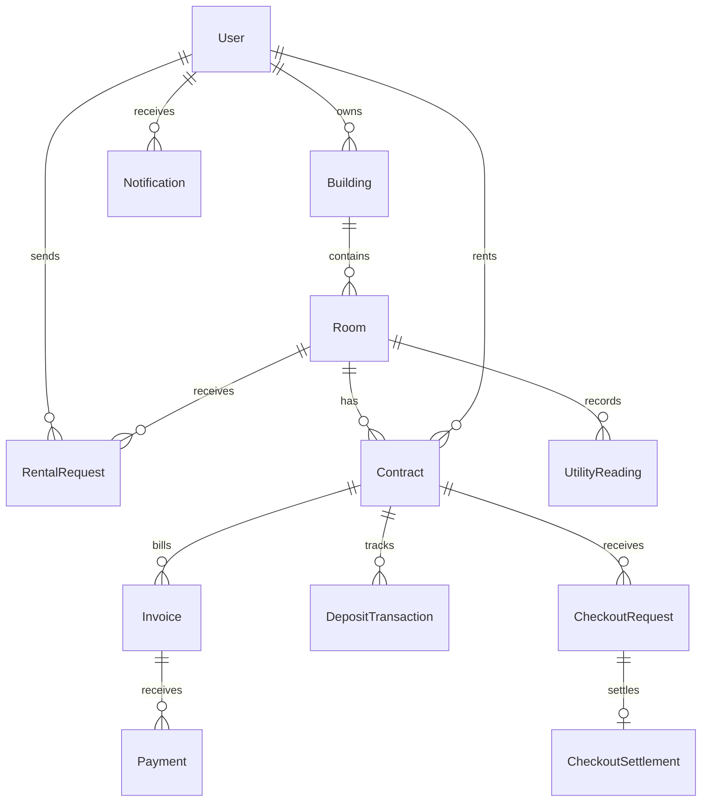

# Thiết kế MongoDB — quản lý trọ

Database local: `boarding_house`. Chạy `npm --prefix backend run db:init` để tạo collection và index; script không xóa dữ liệu, không reset mật khẩu, không drop index. Các model nằm trong `backend/src/entities`, được export tại `backend/src/entities/index.js`.

## Collection và use case

| Collection          | Nội dung                                                               | Use case          |
| ------------------- | ---------------------------------------------------------------------- | ----------------- |
| users               | Tài khoản, hash mật khẩu, role, emailVerifiedAt, active                | 1–6, 9            |
| otpchallenges       | Hash OTP, mục đích xác thực/reset, số lần thử, hạn dùng                | 4, 5, 40          |
| buildings           | Dãy trọ, địa chỉ, chủ trọ, quản lý được phân công                      | 7, 10             |
| rooms               | Phòng, dãy, mã phòng, giá thuê, trạng thái, diện tích/sức chứa         | 8, 13, 17, 33     |
| tenantprofiles      | Hồ sơ người thuê, liên hệ khẩn cấp                                     | 11                |
| rentalrequests      | Yêu cầu thuê, trạng thái và người xử lý                                | 18–20             |
| contracts           | Hợp đồng, kỳ thuê, tiền thuê/cọc, người duyệt, bản chụp chính sách/phí | 12, 21, 22, 34    |
| utilityrates        | Đơn giá điện nước theo dãy và ngày hiệu lực                            | 14                |
| servicefees         | Dịch vụ/phí theo dãy, đơn vị tháng/người/sử dụng                       | 15                |
| contractpolicies    | Chính sách theo dãy và phiên bản                                       | 16                |
| utilityreadings     | Chỉ số cũ/mới điện nước theo phòng và tháng                            | 23                |
| checkoutrequests    | Yêu cầu trả phòng                                                      | 24, 37            |
| checkoutsettlements | Kiểm tra phòng, công nợ, khấu trừ cọc, hoàn trả                        | 25                |
| deposittransactions | Sổ tiền cọc: nhận, cấn trừ, hoàn                                       | 26                |
| invoices            | Hóa đơn tháng, dòng tiền phòng/điện/nước/phí, tổng tiền                | 27, 30, 32, 35    |
| payments            | Khoản thanh toán, trạng thái, mã chống xử lý trùng                     | 28–31, 38, 39, 41 |
| paymentevents       | Tiếp nhận sự kiện cổng thanh toán, trạng thái xác minh/xử lý           | 29, 41            |
| notifications       | Thông báo trong ứng dụng, thời điểm đã đọc                             | 27, 36            |
| emaildeliveries     | Hàng đợi/nhật ký gửi email và thử lại                                  | 27, 40            |
| auditlogs           | Nhật ký người thao tác trên dữ liệu nghiệp vụ                          | Theo dõi quản trị |

Collection sessions do connect-mongo quản lý khi ứng dụng chạy, không phải entity nghiệp vụ.

## Quan hệ

ObjectId/ref không phải khóa ngoại được MongoDB tự kiểm tra. Service phải kiểm tra bản ghi tham chiếu tồn tại, đúng role và thuộc cùng dãy/phòng/hợp đồng.

## Quy ước và ràng buộc

- Tiền lưu số nguyên VNĐ, không âm, trong Number.MAX_SAFE_INTEGER; giao dịch thanh toán/cọc phải lớn hơn 0. Số lượng/chỉ số cho phép phần lẻ; thành tiền làm tròn một lần trên từng dòng hóa đơn.
- Kỳ hóa đơn/chỉ số dạng YYYY-MM; ngày giờ lưu Date (UTC), hiển thị theo múi giờ Việt Nam.
- Một mã phòng duy nhất trong từng dãy; phòng cũ chưa gắn dãy vẫn hoạt động. Không tự tạo dãy hoặc thay đổi phân công dữ liệu cũ.
- Mỗi phòng có một bản ghi điện/nước mỗi tháng. Mỗi hợp đồng có một hóa đơn mỗi tháng; hóa đơn VOID vẫn giữ khóa để không tạo thêm hóa đơn cùng kỳ. Nếu cần hóa đơn điều chỉnh riêng phải mở rộng loại hóa đơn và khóa nghiệp vụ.
- Một hợp đồng APPROVED/ACTIVE giữ phòng qua occupiesRoom và unique partial index; save/create đồng bộ cờ này. Nhiều hợp đồng DRAFT có thể cùng phòng.
- Một yêu cầu thuê PENDING cho mỗi người/phòng; một yêu cầu trả phòng PENDING/APPROVED cho mỗi hợp đồng.
- Payment có idempotencyKey duy nhất; provider + providerTransactionId duy nhất. Event cổng thanh toán có provider + eventId duy nhất.
- OTP chỉ lưu hash, mặc định không đưa hash vào query result. TTL index dọn bản ghi hết hạn; TTL không xóa ngay lập tức nên service vẫn phải kiểm tra expiresAt, consumedAt và attempts. Cần hash/HMAC với secret, giới hạn gửi/thử OTP, và consume nguyên tử; schema không tự thực hiện các bước này.
- Không lưu mật khẩu rõ, OTP rõ, số thẻ hoặc secret cổng thanh toán trong collection. EmailDelivery chỉ chứa dữ liệu gửi tối thiểu, không chứa mã OTP.

## Phạm vi đã hoàn thành và phần backend tiếp theo

Đã tạo model Mongoose, validation create/save, collection và index trên MongoDB local. Chưa tạo API/UI hoặc service thực thi các use case mới. `active`, `emailVerifiedAt` là trường dữ liệu mới; luồng đăng nhập hiện tại chưa dùng chúng để bắt buộc xác thực/khóa tài khoản.

Validation trong model là validation phía Mongoose, không phải JSON Schema validator phía MongoDB. Ghi trực tiếp bằng Compass/raw driver có thể bỏ qua validation ứng dụng, nhưng vẫn chịu unique index. Middleware pre('validate') không tự chạy trên updateOne/findOneAndUpdate: nghiệp vụ tương lai cần tải document rồi validate/save hoặc cập nhật có kiểm tra rõ ràng.

Building.manager là nguồn phân công theo dãy cho nghiệp vụ mới. Ứng dụng hiện tại vẫn dùng Room.manager theo từng phòng. Chưa thay quyền route sang Building.manager; không được giả định thêm dãy đã tự cấp quyền cho toàn bộ phòng.

Các thao tác sau cần service và transaction khi triển khai:

1. Duyệt hợp đồng: kiểm tra phòng trống, ngày thuê và role; giữ phòng, cập nhật hợp đồng và trạng thái phòng cùng transaction.
2. Lập hóa đơn: lấy giá/chỉ số/chính sách đúng kỳ, chụp đơn giá vào lines; không nhận tổng tiền đáng tin từ client.
3. Thanh toán: xác thực callback, đối chiếu số tiền/đơn vị tiền/mã hóa đơn, chống lặp; ghi Payment và cập nhật paidAmount/status hóa đơn nguyên tử.
4. Trả phòng: kiểm tra công nợ và tiền cọc thực nhận; ghi quyết toán/sổ cọc, kết thúc hợp đồng và đổi trạng thái phòng cùng transaction.
5. Notification/EmailDelivery: gửi bằng worker có retry và deduplication; chưa có dịch vụ gửi mail thật.

MongoDB transaction nhiều document cần replica set (hoặc Atlas). Cấu hình local hiện tại chưa được chuyển sang replica set; không chạy transaction nghiệp vụ chỉ bằng standalone server.

Công nợ được tính từ tổng (total - paidAmount) của hóa đơn ISSUED/PARTIAL quá hạn hoặc chưa trả. Doanh thu tiền thực thu lấy Payment SUCCEEDED theo paidAt, tách riêng tiền cọc. Báo cáo tổng hợp từ hóa đơn, thanh toán và sổ cọc; chưa tạo collection doanh thu để tránh dữ liệu tổng hợp lệch nguồn. Hoàn tiền một phần cần mở rộng sổ refund khi triển khai; status REFUNDED hiện chỉ biểu diễn hoàn toàn giao dịch.

## Kiểm thử

`npm test` chạy trên MongoDB tạm, tách biệt database local. Có test tiền/ngày/chỉ số không hợp lệ, hợp đồng giữ phòng trùng, hóa đơn trùng tháng, tổng hóa đơn sai, giao dịch/event trùng, OTP TTL/ẩn hash và mã phòng theo dãy, cùng các kiểm thử phân quyền hiện có.
